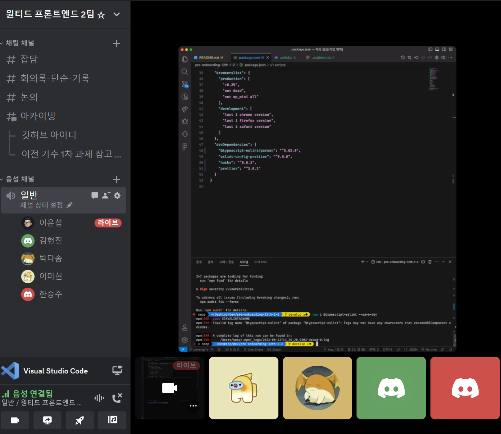
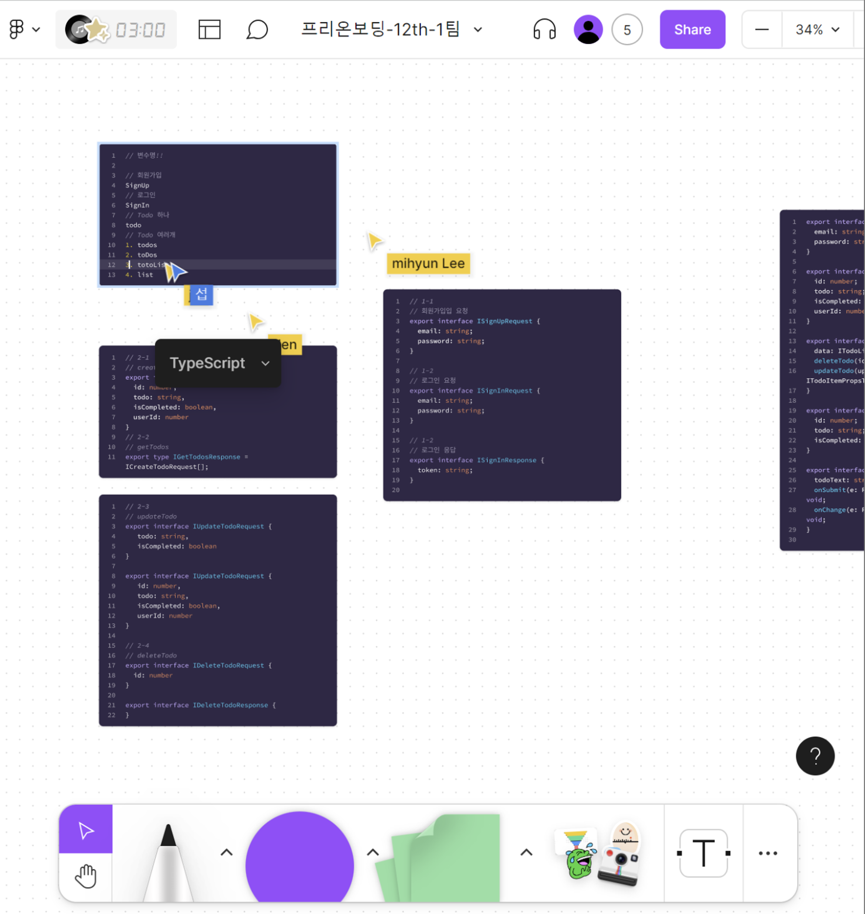

2022년 1월, 다니던 회사를 개인 사정으로 퇴사하고 쉬던 중에 노후자금을 벌기 위해 작은 서비스를 만들었다. 용돈벌이 정도로 생각했으나, 예상했던 것보다 많은 사람들이 이용해주어 본격적으로 서비스를 키워보기로 했다. 당시 나는 이 서비스와 함께 **원티드 부트캠프**를 병행하고 있었고, 부트캠프 수료 후엔 내가 배운 개발 지식들을 우리 서비스에 녹여내고 싶었으나, 외부 요인으로 인한 서비스 제한과 순이익 감소가 겹쳐 우리는 사업을 접게 되었다.

 

개발자가 되고픈 생각은 꾸준했기 때문에 개발자로 재취업을 하려했지만 서비스를 키워나가면서 운영과 CX에만 집중하게 되고 개발은 거의 손을 놓은 상태라 이대로 취업 준비를 하기엔 무리라고 생각했고, 마침 원티드에서 **프리온보딩 인턴십**을 오픈하여 지원하게 됐다. 대부분의 정보는 인터넷에 공개되어 있으니 **내가 참여한 과정**을 중심으로 작성해 보겠다.

## 선발 과정

선발 과정은 간단하다. 사전 과제를 만들고 이를 Github의 Repo에 업로드한 후 지원서에 첨부하여 제출하면 된다. 인턴십은 수업과 과제를 병행하므로 두 가지를 모두 따라가려면 기본은 알고 있어야 한다는 것 같았다. 사전 과제는 주어진 API를 이용하여 To-Do List를 만드는 것. 대부분의 비전공자들은 To-Do List로 공부를 시작하니 어려운 것은 없었다. 제출 후 추가적인 선발 과정은 없으며, 문자로 합격 연락이 오면 그 때 수강을 위한 등록을 하게 된다.

## 경쟁률

온라인으로 이뤄지는 것인만큼 수용인원의 제한이 없기에 많은 인원이 참여할 줄 알았으나, 지원자 중에서 고르고 골라 100명가량의 인원을 선발한 것 같았다. 합격 후 OT 때 많은 사람들이 경쟁률에 대해 질문하여 궁금해졌는데, 내가 참여했을 당시에는 **3:1**의 경쟁률이었다고 한다.

## 교육 과정

교육 과정은 대부분 강의(매주 화/금)와 개인 과제 및 팀 과제로 한달동안 진행된다. 특이한 점은 프리온보딩 인턴십은 매번 같은 교육이 아니다! 인턴십이 열릴 떄마다 **강의 내용과 과제가 다른 것**으로 알고 있다.

 

0. OT

- 프리온보딩 인턴십에 대한 설명과 어떻게 진행되는지 등에 대한 설명을 해준다.
- 디스코드와 노션, 줌을 이용하기 떄문에 미리 가입해둬야 한다. (합격 후 등록이 완료되면 메일로 안내해준다.)
- 디스코드는 소통, 노션은 인턴십 일정, 줌은 강의 때 이용된다.

 

1. 1주차

- 수업
  - 화요일: 개발자가 팀으로 일하는 방법(Git & Github, ESLint, Prettier, Husky 등)
  - 금요일: 서버와 클라우드 컴퓨팅, CI/CD
- 과제: OT 때 구성된 팀이 모여 사전 과제의 Best Practice를 만들고 제출
  - 조건: 상태 관리를 위한 라이브러리는 이용하지 않는다.
- [우리 팀 Github](https://github.com/wanted-internship-team/pre-onboarding-12th-1-2) / [개인 Github](https://github.com/devseop/wanted-pre-onboarding-frontend)

   

  
  

    

1. 2주차

- 수업
  - 화요일: React 렌더링 최적화 & Advanced Hook
  - 금요일: useEffect, Custom Hook, 관심사의 분리, 횡단 관심사
- 과제: Github Repo의 이슈 목록과 상세 내용을 확인하는 웹 사이트 구축 (개인/팀)
  - 조건
    - React, JS, TS를 활용한다.
    - 안내받은 라이브러리 외에는 사용을 제한한다.
    - 지정된 조건에 맞게 데이터를 요청 및 표시해야 한다.
    - 인피니티 스크롤을 구현해야 한다.
- [팀 Github](https://github.com/wanted-internship-team/pre-onboarding-12th-2-2) / [개인 Github](https://github.com/devseop/po-fe-12th-w2)

     

  
   

1. 3주차

- 수업
  - 화요일: Context API, 횡단 관심사, 의존성
  - 금요일: 의존성, TypeScript
- 과제: 주어진 API를 이용해 검색 창, 검색어 추천, 캐싱 기능을 구현 (개인/팀)
  - 조건
    - React, JS, TS를 활용한다.
    - 안내받은 라이브러리 외에는 사용을 제한한다.
    - API 호출별로 로컬 캐싱을 구현한다.
    - API 호출 횟수를 줄이는 전략을 수립하고 구현한다.
- [팀 Github](https://github.com/wanted-internship-team/pre-onboarding-12th-3-2) / [개인 Github](https://github.com/devseop/po-fe-12th-w3)

 

4. 4주차

- 수업
  - 화요일: 소프트웨어 테스트
  - 금요일: 실행 컨텍스트, 클로저
- 과제: 주어진 데이터를 기반으로 시계열 차트를 구현 (개인)
  - 조건
    - React, JS, TS를 활용한다.
    - 안내받은 라이브러리 외에는 사용을 제한한다.
    - 호버 기능을 구현한다.
    - 필터링 기능을 구현한다.
- [개인 Github](https://github.com/devseop/po-fe-12th-w4)

## 좋았던 점들

### 같은 케이스, 다른 코드

사전 과제를 바탕으로 팀원들과 코드에 대해 토론하고 Best Practice를 선정하는 과정은 정말 새롭고 즐거웠다. 같은 요구사항이라도 서로 다르게 표현한다는 것, 더 나아가 어떤 부분을 더 개선할 수 있을까 끊임없이 이야기를 하다보면 자정이 넘기 일쑤였다.

 

부트캠프와 인턴을 경험했기에 신입치고 가독성 좋게 코드를 작성하고 있다고 생각했지만, 팀원들의 코드와 작성 의도를 듣다보면 **개발자에 대한 직업 정신을 가벼이 여긴 것 같아 부끄러워지는** 경우가 많았다. 그래서 남은 기간동안 모르는 것은 물어보고, 개인 과제에 녹여낼 수 있도록 최대한 활용하기로 했다.

### 내 자신에 대한 과대평가

인턴십을 진행하면서 **내 자신이 얼마나 부족한지**를 직접 경험할 수 있었다. 물론 내가 모든 것을 온전히 알고 있다는 생각은 한 적 없지만 나름대로 프로젝트를 진행해봤으니 "**내가 작성한 코드가 Best Practice로 뽑히겠지?**"라고 감히 생각했었다.

 

당연하게도 프리온보딩 인턴십을 진행하면서 딱 1번 뽑히고(이마저도 기능 구현에 어려움이 있어 내 코드가 유일하게 작동했기 때문) 전무했다. 특히나 과제 중 로컬 캐싱을 구현해야 하는 요구사항이 있었는데, 이 때 나는 당연히 '저장이라면 Local Storage지!'라고 생각하고 해당 기능을 이용하여 개인 과제를 구현했다. 그리고 팀 과제 때 팀원들에게 물어보니 나를 제외한 모든 팀원들이 Cache API를 이용하여 구현했다는 것을 듣고 얼굴이 붉어지다 못해 터지는 줄 알았다. 나는 요구사항의 동작만 생각한 반면에 팀원들은 **어떻게 이 기능을 구현할 수 있는지부터 시작해서 기술의 장단점을 파악**하여 구현한 것이다.

 

프리온보딩 인턴십에서 개발을 하는 방법과 자세에 대해 제대로 깨닫게 됐다.

### 라이브러리 맹신 금지

프로젝트를 진행하다 보면 라이브러리를 만능 도구로 생각하고 사용하는 경우가 잦다. 물론 유명한 라이브러리는 검증된 코드들의 집합체이지만, **모든 고민을 라이브러리에 위임하는 것은 위험할 뿐만 아니라 스스로 생각하는 방식을 없애버릴 수 있다.** 프리온보딩 인턴십은 사전 과제에서 전역 상태 관리를 위한 라이브러리는 사용은 금지였고, 팀 과제를 진행하면서도 팀원들과 개념을 더 공부하기 위해 Context API만을 이용하여 과제를 수행했다. 이렇게 먼저 제한을 두고 과제를 수행하다보니, 나중에는 팀원들이 RTK-Query를 JavaScript와 TypeScript로 구현하여 동작하는 것도 볼 수 있었다. 덕분에 많은 것을 보고 배울 수 있었다.

## 결론

- 인턴 이후로 잘 쓰지 않았던 Git의 `branch`와 `checkout`을 사용하면서 감을 다시 익히는 계기가 되었다.
- 강의들이 정말 좋았다. 부족하다고 느끼는 개념들만 쏙쏙 골라 알려주는 것이 정말 좋았다. 특히 '**`useState`와 `useEffect`도 클로저를 기반으로 동작하는 Hook이다.**'라는 것은 정말 인상적이었다.
- 모두들 같은 목표를 가지고 있기 때문에 서로 돕는 문화가 형성됐다. 스케줄을 조정하고 서로 피해를 주지 않기 위해 맡은 역할을 하고, 이를 넘어서 먼저 나서서 할 일을 미리 해두기도 하는 등 서로가 서로를 배려해준다는 것을 느꼈다.
- 한달정도의 짧은 시간이지만 정말 소중한 경험이었고 새로운 가르침을 많이 얻었다. 기본기를 열심히 갈고 닦았다면 더 깊은 내용까지 공부하고 더 많은 걸 얻어갈 수 있었을텐데, 그러지 못해 아쉬움도 생기고 스스로를 다잡는 계기도 됐다.
