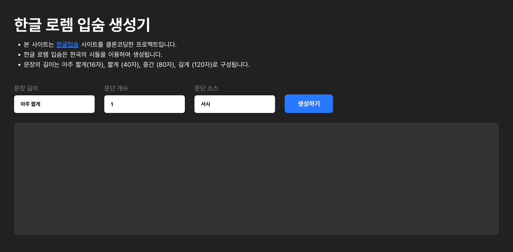

지인이 간단한 웹 페이지가 필요하다고 하여 디자인 작업을 하던 중에 더미 텍스트가 필요했습니다. 시를 이용한 한글 로렘 입숨 생성기를 자주 사용한 터라 해당 사이트에 접속했으나 무슨 일인지 이용할 수가 없었습니다. 의미를 알 수 없는 문장을 넣는 것 뿐인데 그냥 영문으로 된 로렘 입숨을 입력하는 건 뭐가 다른가 싶겠지만 글자 하나하나가 차지하는 공간이 다르고 눈으로 봤을 때 시각적인 느낌도 다릅니다. 어쨌든 필요한 작업물을 전달하고 나서 생각이 들었습니다. '제품을 직접 만들고 싶어서 개발자가 되기로 한 거 아니었나? 한 번 만들어보자!'. 다행이도 이용했던 기억을 되살려봤을 때 기술적인 복잡도가 높지 않을 것 같아 빠르게 실행으로 옮겼습니다.

## 결과물 미리보기

- [https://github.com/devseop/kr-lipsum](https://github.com/devseop/kr-lipsum)

## 기술 스택 결정하기

프론트엔드는 별다른 고민을 하지 않았습니다. React와 TypeScript를 선택했고, Netlify로 배포하기로 결정했습니다. 스타일은 emotion을 사용했습니다.

문제는 로렘 입숨을 만들 때 필요한 문단 소스(시)였습니다. 해당 데이터는 동적인 데이터가 아니고, 추가적인 정보가 필요한 것도 아니기에 객체 형태로 프로젝트 내부에 저장하여 사용하기로 결정했습니다. 이렇게 되니 백엔드 또한 마찬가지로 구성할 필요가 없었습니다.

## 개발하기

1. 화면에서 옵션(문단 길이와 개수, 소스)을 선택하면 옵션에 따른 한글 로렘 입숨이 노출됩니다.
2. 선택한 소스는 긴 문자열 형태로 되어있으며, 공백을 기준으로 나뉘고 재조합됩니다.

### 1. 타입 구조

TypeScript를 활용하여 프로젝트의 쓰일 type 구조를 미리 정의합니다.

```ts
// 생성된 한글 로렘 입숨
export type ParagraphProps = string[];

// 한글 로렘 입숨 생성을 위한 폼양식
export type FormStateProps = {
  paragraphNumber: number;
  paragraphLength: string;
  paragraphSource: string;
  generatedParagraphs: ParagraphProps;
};

// 한글 로렘 입숨에 쓰일 시 객체
export type PoemProps = {
  author: string;
  poem: string;
};

// 시 객체의 모음
export type PoemListProps = PoemProps[];
```

`PoemProps`는 `author`와 `poem`을 가지고 있는데 이는 기획 초기 단계에 시인의 이름을 활용할 수 있는 방법을 생각했던 흔적입니다. 기획 초기에는 한글 로렘 입숨을 생성하는 것뿐만 아니라 mock data를 만드는 것까지 발전하였으나, 작은 단계부터 실행하여 최소의 결과물을 도출한 후 살을 덧붙여 나가는 것이 나은 판단이라고 생각되어 폐기하였습니다.

### 2. 문자열 재조합

선택된 소스의 문자열을 공백(' ')을 기준으로 하여 모두 나눈 후, `Math.floor`와 `Math.random`을 이용하여 분리된 문자열을 선택하기 위한 `randomIndex`를 만들고 이를 이용해 선택된 단어를 `paragraph`에 추가합니다. 이 과정은 `paragraph`의 길이가 `maxLength`보다 커지기 전까지 반복되며, 동작이 끝나면 `trim()`으로 문자열 끝의 공백을 없앤 `paragraph`를 `randomParagraphs`에 넣어 반환하도록 합니다.

```ts
export const getRandomParagraphs = (
  formData: FormStateProps,
): ParagraphProps => {
  const {
    paragraphSource: source,
    paragraphNumber: count,
    paragraphLength: length,
  } = formData;

  const selectedPoem = poems.find((peom) => peom.subject === source);

  if (!selectedPoem) return [];

  const lines = selectedPoem.poem.split(' ');
  const randomParagraphs: ParagraphProps = [];
  const maxLength =
    length === '아주 짧게'
      ? 16
      : length === '짧게'
      ? 40
      : length === '중간'
      ? 80
      : 120;

  for (let i = 0; i < count; i++) {
    let paragraph = '';
    while (paragraph.length < maxLength) {
      const randomIndex = Math.floor(Math.random() * lines.length);
      paragraph += lines[randomIndex] + ' ';
    }
    randomParagraphs.push(paragraph.trim());
  }

  return randomParagraphs;
};
```

### 3. 동작 확인 및 스타일링

정상적으로 동작되는지 확인하고 emotion/styled를 이용해 UI 스타일링을 했습니다.



## 결과

- [kr-lipsum.netlify.app](https://kr-lipsum.netlify.app/)
- 한글 로렘 입숨이 필요한 분들이라면 사용해보시고 의견을 남겨주세요!

## 회고

- 개발자가 되고 싶었던 이유를 실현해볼 수 있었습니다.
- 디자이너와 개발자 사이에서 기획적인 부분을 잘 조절하며 진행한 것 같습니다.
- `for`함수와 `while`함수를 사용하면서 둘의 차이를 다시 한 번 공부할 수 있었습니다.
- 시간을 좀 더 쏟아부어서 짧은 기간에 완성했으면 하는데 그렇지 못한 것은 아쉬웠습니다.
