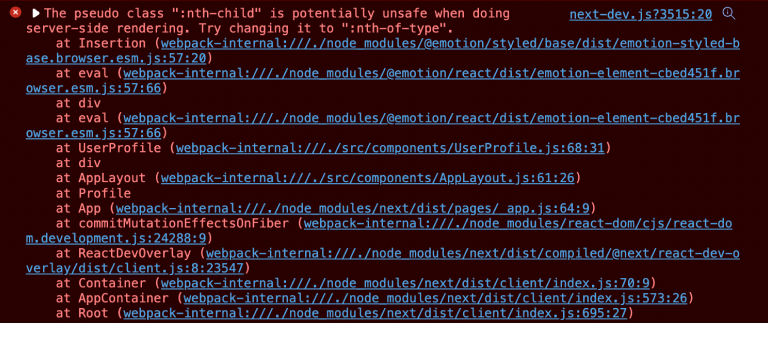

리스트 형태의 컴포넌트를 만들 때면 특정 순서의 컴포넌트 스타일만 변경해줘야 할 때가 있다. 그럴 때 `first-child`나 `nth-child`를 이용하여 특정 컴포넌트를 선택하여 공통된 스타일을 변경하거나 추가할 수 있다.

나는 이 속성을 좋아하고 즐겨 쓰는 편인데, 반복되는 컴포넌트가 있는 화면에서 최하단의 컴포넌트에 margin-bottom을 추가하여 모든 컨텐츠가 화면에 잘 나오도록, 또한 컨텐츠 하단에 여백을 두어 시선이 편안해지도록 하기 위함이다.

얼마전 Next.js와 emotion을 이용하여 프로젝트를 시작했고 언제나 그랬듯이 nth-child를 이용해 스타일을 변경하니 콘솔에서 아래와 같은 경고가 떴다.
</br>

</br>



## "nth-child"는 서버-사이드 렌더링시 잠재적인 위험을 갖고 있으니 "nth-of-type"으로 변경하시오.

"nth-child"는 서버-사이드 렌더링시 잠재적인 위험을 갖고 있으니 "nth-of-type"으로 변경하시오.
해결방법을 알려주니 수정하는데는 문제가 없었지만 왜 nth-child가 문제가 되는건지 궁금했다. 찾아보니 컴포넌트를 SSR할 때 스타일 요소도 같이 SSR이 되기 때문에 nth-child는 원하는 동작을 하지 않을 수 있다고 한다.

[출처: github/emotion-js](https://github.com/emotion-js/emotion/issues/1178)

## 그럼 "nth-child"와 "nth-of-type"의 차이점은 뭘까?

```html
<div class="container">
  <p>p 1</p>
  <span>span 1</span>
  <p>p 2</p>
  <span>span 2</span>
  <p>p 3</p>
</div>
```

위 예시에서 `p 3`의 스타일을 변경하고 싶다면 아래와 같이 적용해야 한다.

```css
/* nth-child */
.container:nth-child(5) {
  font-size: 16px;
  color: orange;
}

/* nth-of-type */
.container > p:nth-of-type(3) {
  font-size: 16px;
  color: orange;
}
```

예시 코드를 보면 `nth-child`는 모든 요소를 포함 해서 순서를 찾기 때문에 부모 컴포넌트에서 `nth-child`를 적용하여 원하는 요소를 찾아야 하고, `nth-of-type`은 특정 요소만을 포함 하여 순서를 찾으므로 원하는 요소를 선택(예시에서는 p), 선택한 요소의 순서를 적용하면 되는 것이다.
